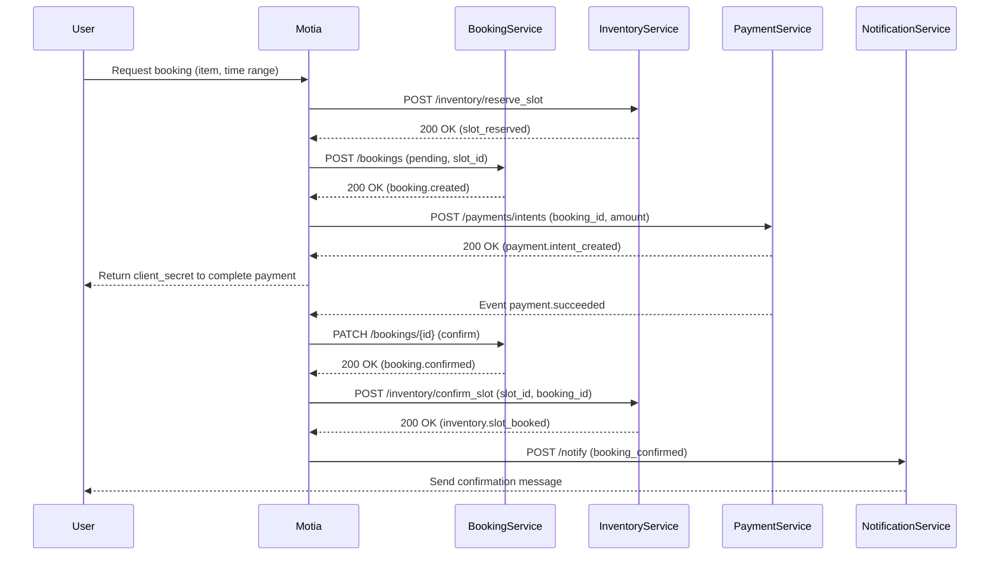

# Rent Anything, Anytime
The premium peer-to-peer marketplace for hourly rentals. Discover cameras, tools, gear, and more nearby.

## rentany-be

A Motia project created with the starter template.

## What is Motia?

Motia is an open-source, unified backend framework that eliminates runtime fragmentation by bringing **APIs, background jobs, queueing, streaming, state, workflows, AI agents, observability, scaling, and deployment** into one unified system using a single core primitive, the **Step**.

## Quick Start

```bash
# Start the development server
npm run dev
# or
yarn dev
# or
pnpm dev
```

This starts the Motia runtime and the **Workbench** - a powerful UI for developing and debugging your workflows. By default, it's available at [`http://localhost:3000`](http://localhost:3000).

```bash
# Test your first endpoint
curl http://localhost:3000/hello
```

## Step Types

Every Step has a `type` that defines how it triggers:

| Type | When it runs | Use case |
|------|--------------|----------|
| **`api`** | HTTP request | REST APIs, webhooks |
| **`event`** | Event emitted | Background jobs, workflows |
| **`cron`** | Schedule | Cleanup, reports, reminders |

## Development Commands

```bash
# Start Workbench and development server
npm run dev
# or
yarn dev
# or
pnpm dev

# Start production server (without hot reload)
npm run start
# or
yarn start
# or
pnpm start

# Generate TypeScript types from Step configs
npm run generate-types
# or
yarn generate-types
# or
pnpm generate-types

# Build project for deployment
npm run build
# or
yarn build
# or
pnpm build
```

## Project Structure

```
steps/              # Your Step definitions (or use src/)
motia.config.ts     # Motia configuration
```

Steps are auto-discovered from your `steps/` or `src/` directories - no manual registration required.

## Learn More

- [Documentation](https://motia.dev/docs) - Complete guides and API reference
- [Quick Start Guide](https://motia.dev/docs/getting-started/quick-start) - Detailed getting started tutorial
- [Core Concepts](https://motia.dev/docs/concepts/overview) - Learn about Steps and Motia architecture
- [Discord Community](https://discord.gg/motia) - Get help and connect with other developers

## RentAny Architecture

### Roles and Boundaries

- **Motia (this repo)**: Acts purely as the **orchestrator** and workflow engine. It coordinates cross-service flows, listens to domain events, and invokes service APIs, but **never accesses databases or Redis directly**.
- **`/apps/api` services**: Own all **CRUD operations and data models**. Each service exposes **HTTP APIs and domain events** and owns its **own persistence** (DB schemas, migrations, caches).
- **`/apps/api/shared/**`**: Contains shared, infrastructure-level libraries (e.g. DB client factories, Redis clients, low-level utils, constants). These are imported by services, **not by Motia steps**.
- **Cross-service flows**: Implemented as **event-driven sagas**: Motia orchestrates them by emitting and reacting to events and by calling public HTTP endpoints on services.

### Service Responsibilities & Data Ownership (`/apps/api/services`)

- **`auth`**: Owns authentication concerns: OTP lifecycle, sessions, tokens, and auth logs. Does **not** manage profiles or KYC.
- **`user`**: Owns user profile data and user lifecycle. Responsibilities:
  - **CRUD operations**: Create user, update profile, manage addresses, block/unblock user
  - **Data models**:
    - `User`: `id`, `name`, `email`, `mobile`, `emailVerified`, `mobileVerified`, `role` (`USER` | `ADMIN`), `status` (`ACTIVE` | `BLOCKED`), `createdAt`
    - `Address`: `id`, `userId`, `line1`, `city`, `state`, `pincode`, `lat`, `lng`
  - Does not store auth secrets (handled by `auth` service)
  - **Motia usage**: ❌ **NO CRUD** - Motia never directly creates/updates users or addresses. ✅ **OTP login workflow** - Motia orchestrates OTP verification via `auth` service and may read user profile data after authentication.
- **`item`**: Owns the item catalog: listing metadata, descriptions, media, pricing rules, and business constraints. Does **not** track availability over time.
- **`inventory`**: Owns **time-based availability** for items. Responsible for creating, updating, and querying availability slots and reservations, ensuring no overlaps.
- **`booking`**: Owns booking lifecycle and state machine. Links `user`, `item`, and inventory reservations into a coherent booking record.
- **`payment`**: Owns payment intents, captures, refunds, PSP (e.g. Stripe) integration, and payment state. Tracks monetary amounts but does not know detailed booking rules.
- **`return`**: Owns post-booking flows: item return, inspection outcomes, damage/late fees computation, and final refund/charge decisions.
- **`chat`**: Owns conversations and messages between renter and owner, including read states and attachments.
- **`notification`**: Owns all outbound messaging (email, SMS, push, in-app). Subscribes to events from other services and from Motia workflows.
- **`admin`**: Owns backoffice functionality (feature flags, overrides, manual adjustments) and admin-facing dashboards.

Data always flows **through the owning service**. For example, only `inventory` can mutate time slots; only `booking` can change booking state; only `payment` can settle or refund monetary transactions.

### Core Domain Events (`/apps/api/events`)

#### Booking Events (`booking.events.ts`)

- **`booking.created`**
  - **Published by**: `booking`
  - **Payload**: `booking_id`, `user_id`, `item_id`, `inventory_slot_id`, `currency`, `amount_due`, `status`
  - **Subscribed by**: `payment` (create payment intent), `notification` (send pending payment email), Motia workflows.
- **`booking.confirmed`**
  - **Published by**: `booking`
  - **Payload**: `booking_id`, `user_id`, `item_id`, `inventory_slot_id`, `payment_id`
  - **Subscribed by**: `notification` (confirmation message), `inventory` (optional analytics), Motia workflows.
- **`booking.cancelled`**
  - **Published by**: `booking`
  - **Payload**: `booking_id`, `reason`, `cancellation_policy_applied`, `user_id`, `item_id`, `inventory_slot_id`
  - **Subscribed by**: `inventory` (release slot), `payment` (compute refunds), `notification` (inform parties), Motia workflows.

#### Payment Events (`payment.events.ts`)

- **`payment.intent_created`**
  - **Published by**: `payment`
  - **Payload**: `payment_id`, `booking_id`, `amount`, `currency`, `provider`, `client_secret`
  - **Subscribed by**: Motia workflows, `notification` (optional).
- **`payment.succeeded`**
  - **Published by**: `payment`
  - **Payload**: `payment_id`, `booking_id`, `amount`, `currency`, `provider_charge_id`
  - **Subscribed by**: `booking` (confirm booking), `notification` (receipt), Motia workflows.
- **`payment.failed`**
  - **Published by**: `payment`
  - **Payload**: `payment_id`, `booking_id`, `reason`, `provider_error_code`
  - **Subscribed by**: `booking` (mark as payment_failed / expired), `notification` (failure email/SMS), Motia workflows.
- **`payment.refund_requested`**
  - **Published by**: `booking` or `return`
  - **Payload**: `refund_id`, `payment_id`, `booking_id`, `amount`, `reason`
  - **Subscribed by**: `payment` (initiate refund with PSP), Motia workflows.
- **`payment.refunded`**
  - **Published by**: `payment`
  - **Payload**: `refund_id`, `payment_id`, `booking_id`, `amount`, `status`
  - **Subscribed by**: `booking`, `return`, `notification`.

#### Inventory Events (`inventory.events.ts`)

- **`inventory.slot_reserved`**
  - **Published by**: `inventory`
  - **Payload**: `slot_id`, `item_id`, `start_at`, `end_at`, `booking_id` (optional pending creation), `hold_expires_at`
  - **Subscribed by**: `booking` (create or update booking), Motia workflows.
- **`inventory.slot_released`**
  - **Published by**: `inventory`
  - **Payload**: `slot_id`, `item_id`, `reason` (`payment_failed`, `cancelled`, `expired_hold`, etc.)
  - **Subscribed by**: `booking` (update status), Motia workflows, `notification`.
- **`inventory.slot_booked`**
  - **Published by**: `inventory`
  - **Payload**: `slot_id`, `item_id`, `booking_id`, `start_at`, `end_at`
  - **Subscribed by**: `booking`, `notification`, analytics.

All event handlers must be **idempotent** by design (e.g. using event IDs and consumer offsets) so that retries are safe, especially for `payment` and `inventory`.

### Motia Workflows (`/apps/api/workflows` vs Motia Steps)

The canonical workflows live conceptually in `/apps/api/workflows` but are **implemented in this Motia project** as Steps and visual flows:

- **`otp-login.workflow.ts`**
  - Receive login request (phone/email).
  - Call `auth` service to issue OTP and send via `notification`.
  - Verify OTP via `auth`, then emit an event like `auth.otp_login_succeeded` and optionally call `user` to hydrate profile data.
- **`booking.workflow.ts`**
  - Validate input (user, item, desired time range).
  - Call `inventory` to **check availability** and **reserve a slot** (temporary hold).
  - Call `booking` to create a pending booking tied to the reserved slot.
  - Call `payment` to create a payment intent; wait for `payment.succeeded` / `payment.failed`.
  - On success: mark booking confirmed and finalize `inventory.slot_booked`. On failure/timeout: cancel booking and trigger `inventory.slot_released`.
- **`payment.workflow.ts`**
  - Coordinate user-initiated payments and PSP webhooks.
  - React to PSP events (via `payment` service webhooks → events) to update booking status and notify parties.
- **`cancellation.workflow.ts`**
  - Receive cancellation request, calculate penalties via `booking` and `item` rules.
  - If needed, request partial/full refund via `payment` (`payment.refund_requested`).
  - Ensure `inventory.slot_released` is emitted and booking state transitions to a terminal cancelled state.
- **`return-refund.workflow.ts`**
  - Coordinate item return, inspection, damage/late fees computation (via `return` and `booking`).
  - Drive additional charges or refunds through the `payment` service and emit appropriate notifications.

Motia expresses these flows as **sagas** by chaining API calls and subscribing to events, without owning any domain data.

### Time-Based Inventory Model

Inventory is **time-based, not quantity-based**. The `inventory` service manages a canonical `slot` model, for example:

- **Slot fields**: `slot_id`, `item_id`, `start_at`, `end_at`, `status` (`free`, `held`, `booked`), `hold_expires_at`, audit fields.
- **Lifecycle**:
  - `free` → `held`: temporary hold when a user initiates a booking; triggered by an availability/reservation API and emits `inventory.slot_reserved`.
  - `held` → `booked`: once payment succeeds and booking is confirmed; emits `inventory.slot_booked`.
  - `held` → `free`: if payment fails, booking is cancelled, or hold expires; emits `inventory.slot_released`.
  - `booked` → `free`: after booking is completed or cancelled (subject to policy).
- **Conflict rules**: The `inventory` service enforces **no overlapping slots** for the same `item_id` and time range via DB constraints and service logic. Motia only asks for operations like “reserve this range” and reacts to success/failure.

### Cross-Service Interaction Rules

- **No direct DB/Redis from Motia**: All reads/writes go through public HTTP APIs or are driven by domain events. Motia never imports DB clients or queries tables.
- **Standard API contracts**: All services expose JSON-based HTTP APIs with consistent envelopes (e.g. `{ data, error, meta }`) and correlation IDs propagated from Motia.
- **Event-driven sagas**: Long-running flows (booking, payment, cancellation, return) are modeled as sagas where each step emits events (`booking.cancelled`, `inventory.slot_released`, `payment.refund_requested`) for downstream consumers.
- **Idempotent consumers**: Every event consumer must handle duplicate events safely to allow retries and at-least-once delivery.

### Mapping to Directories and Types

- **Motia (this repo)**:
  - `src/workflows/**`: Motia Steps and flows implementing `otp-login`, `booking`, `payment`, `cancellation`, `return-refund`.
  - `src/events/**`: Event Steps that subscribe to `booking`, `payment`, and `inventory` events.
  - `src/shared/**`: Lightweight DTO definitions and HTTP clients for talking to `/apps/api` services (ideally using a shared contracts package).
- **API services (`/apps/api`)**:
  - `/apps/api/services/**`: Implementation of the domain services described above.
  - `/apps/api/events/**`: Event definitions and publishing logic (`booking.events.ts`, `payment.events.ts`, `inventory.events.ts`).
  - `/apps/api/workflows/**`: High-level descriptions of workflows, mirrored in Motia as executable flows.
  - `/apps/api/shared/**`: DB, Redis, utils, and constants used by services.

For type safety, you can factor shared domain contracts into a package such as `@rentany/contracts` that is imported by both the Motia project and `/apps/api`.

### Booking Flow Diagram

Below is a high-level booking saga showing Motia orchestrating services via HTTP and events:

